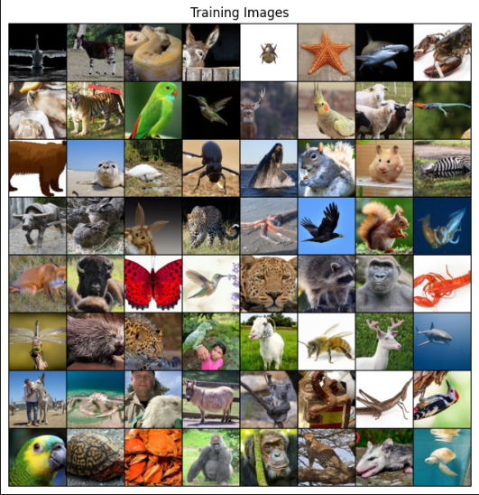
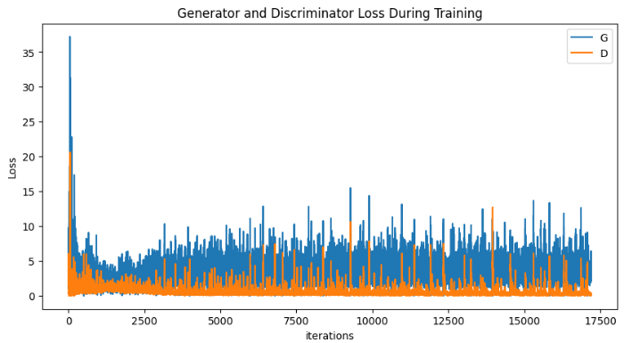
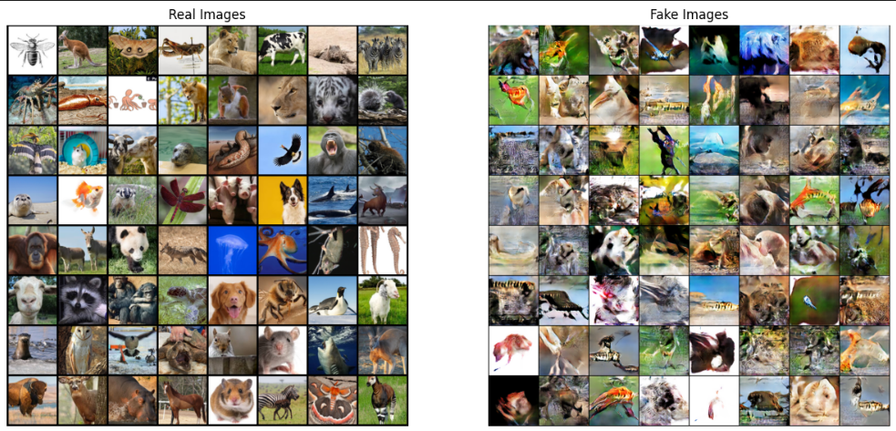
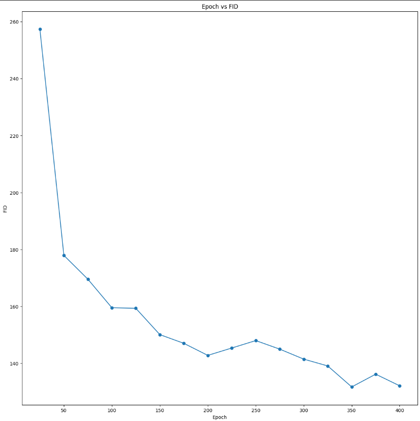
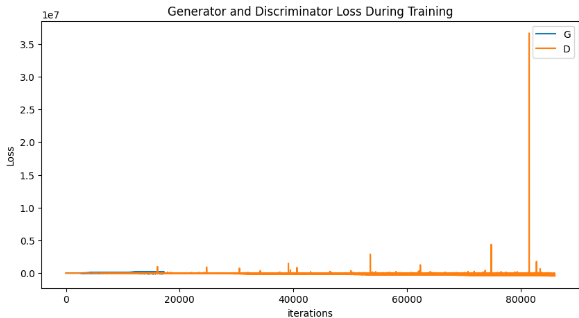
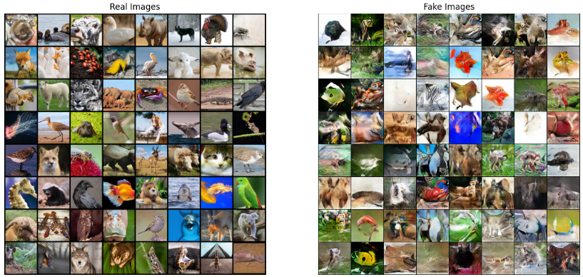
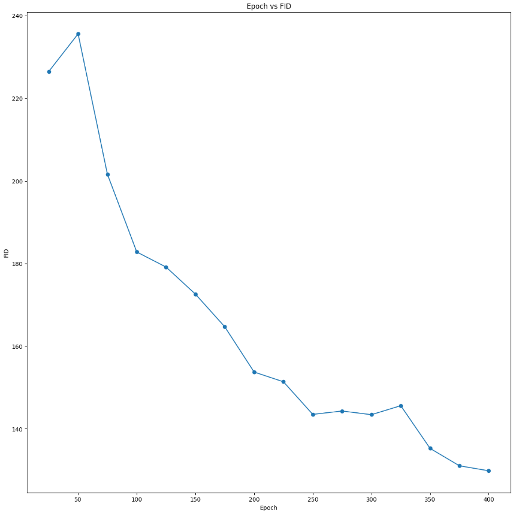
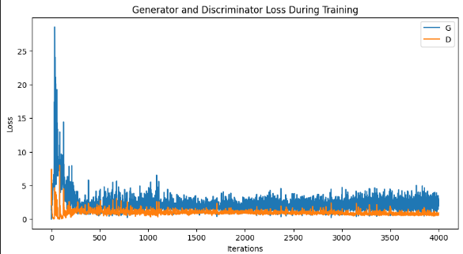
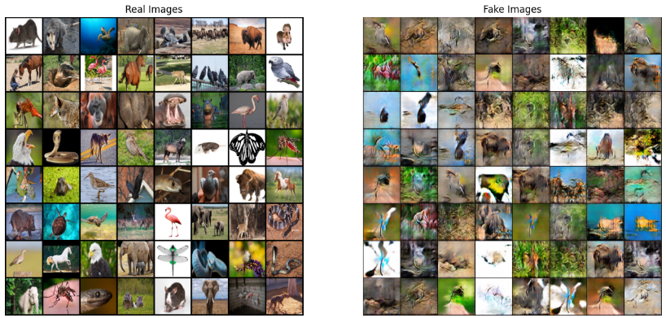
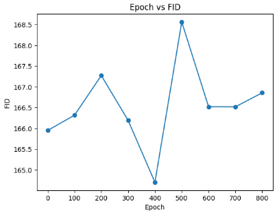

# F-GAN Implementation with DiffAugment

## Description

This project implements various Generative Adversarial Network (GAN) architectures with a focus on the F-GAN objective and DiffAugment techniques. The goal is to generate high-quality, diverse images by minimizing the f-divergence between real and generated data distributions.

## Mathematical Foundation

### F-GAN Objective
Given iid samples {x₁, x₂, ..., xₙ} ~ 𝕡ₓ, we aim to sample from 𝕡ₓ by learning parameter θ that minimizes the f-divergence:

θ* = argmax_θ Df(𝕡ₓ || 𝕡_θ)

The F-GAN objective using variational lower bound is:

min_θ max_w 𝔼_x~𝕡ₓ [gf(Vw(x))] + 𝔼_x̂~𝕡_θ [-f*(gf(Vw(x̂)))]

where:
- f* is the Fenchel conjugate of f
- Vw: 𝒳 → ℝ is the discriminator
- gf: ℝ → dom_f* is the activation function

### Modified Loss Function
For generator optimization, we use:

max_θ 𝔼_x̂~𝕡_θ [log(Dw(x̂))]

instead of the standard:

min_θ 𝔼_x̂~𝕡_θ [log(1 - Dw(x̂))]

## Implementation Details

### Key Components
1. **Dataset**: Animal images dataset with 20 classes
2. **Architecture**:
   - Generator: Deep convolutional network
   - Discriminator: Convolutional classifier

### DiffAugment Implementation
We implemented three variants:
1. DC-GAN with DiffAugment
2. WGAN with DiffAugment
3. ConditionalGAN with DiffAugment

## Results and Performance

### Training Visualizations

#### DC-GAN Results

*Fig 1: Training Pool Images*


*Fig 2: DC-GAN Discriminator and Generator Loss*


*Fig 3: Real vs Generated Images using DC-GAN*


*Fig 4: FID Score vs Epochs for DC-GAN*

#### WGAN Results

*Fig 5: WGAN Discriminator and Generator Loss*


*Fig 6: Real vs Generated Images using WGAN*


*Fig 7: FID Score vs Epochs for WGAN*

#### Conditional GAN Results

*Fig 8: Conditional GAN Discriminator and Generator Loss*


*Fig 9: Real vs Generated Images using Conditional GAN*


*Fig 10: FID Score vs Epochs for Conditional GAN*

### FID Scores Comparison
| Model Type         | DiffAugment    | Improvement |
|--------------------|----------------|-------------|
| DC-GAN             | 112.45         | 20.22       |
| WGAN               | 129.84         | 27.37       |
| Conditional GAN    | 166.85         | 35.55       |

### Key Findings
1. **DiffAugment Impact**: Average FID score improvement of 27.71 points
2. **Model Comparison**: 
   - WGAN performs worse than conditional GAN without DiffAugment
   - With DiffAugment, all models show significant improvement
3. **Visual Analysis**:
   - DC-GAN produces sharper images but with less diversity
   - WGAN shows better stability in training but slightly blurrier outputs
   - Conditional GAN demonstrates better class-specific features but higher FID scores
4. **Loss Patterns**:
   - DC-GAN shows typical adversarial oscillation
   - WGAN exhibits more stable convergence
   - Conditional GAN shows controlled loss progression with class conditioning
5. **t-SNE Visualization Analysis**:
   - Real data shows clear class clustering
   - Generated samples show less distinct clustering, indicating room for improvement in class-specific feature learning

## Installation

Requirements:
- Python 3.8+
- PyTorch 1.7+
- NumPy
- Matplotlib
- scikit-learn

Install dependencies:
```bash
pip install -r requirements.txt
```

## Usage

1. Clone the repository:
```bash
git clone https://github.com/Vimlesh-17/DCGANv-sWGAN.git
```

2. Run the Jupyter notebook:
```bash
jupyter notebook adrl.ipynb
```

3. Follow the notebook sections:
   - Data preparation
   - Model training
   - Visualization
   - Performance evaluation

## Features

- **Multiple GAN Architectures**: Implementation of DC-GAN, WGAN, and Conditional GAN
- **DiffAugment Integration**: Advanced augmentation techniques for improved training
- **Comprehensive Visualization**: t-SNE plots for both real and generated data
- **Performance Metrics**: FID score calculation and comparison
- **Modular Design**: Easy to extend and modify for different datasets

## Future Work

1. Implementation of additional F-GAN variants
2. Extension to higher resolution images
3. Integration of additional augmentation techniques
4. Multi-GPU training support

## Contributing

1. Fork the repository
2. Create your feature branch (`git checkout -b feature/AmazingFeature`)
3. Commit your changes (`git commit -m 'Add some AmazingFeature'`)
4. Push to the branch (`git push origin feature/AmazingFeature`)
5. Open a Pull Request

## License

This project is licensed under the MIT License - see the [LICENSE](LICENSE) file for details.

## Citation

If you use this code in your research, please cite:

```bibtex
@misc{fgan-diffaugment,
  author = {Vimlesh Chouhan},
  title = {F-GAN Implementation with DiffAugment},
  year = {2024},
  publisher = {GitHub},
  journal = {DCGAN vs WGAN},
  howpublished = {\url{https://github.com/Vimlesh-17/DCGANv-sWGAN}}
}
```

## Contact

Your Name - your.email@example.com
Project Link: [https://github.com/Vimlesh-17/DCGANv-sWGAN](https://github.com/Vimlesh-17/DCGANv-sWGAN)